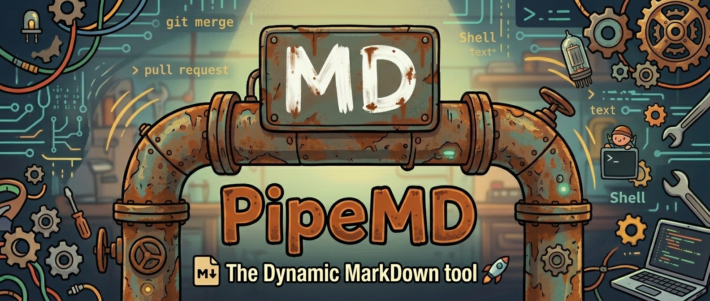

<p align="center">
  
</p>

<h1 align="center">PipeMD</h1>

<p align="center">
  <strong>Real-time project context for AI coding agents.</strong><br>
  Zero git churn. Always fresh. Works with any agent.
</p>

<p align="center">
  <a href="https://www.npmjs.com/package/@pipemd-core/pipemd"></a>
  <a href="https://opensource.org/licenses/ISC"></a>
  
  
</p>

---

## TL;DR

AI coding agents need to know your project state — git status, lint errors, TODOs, who else is editing. Static context files go stale. Auto-updated files pollute your git history.

**PipeMD makes `AGENTS.md` a named pipe.** When your AI reads it, PipeMD intercepts the read, runs your scripts concurrently, and streams live context straight to the agent. Zero files change on disk. The output is completely ephemeral.

Every context block is one file, one emitter, no architectural change. Blocks are inputs — the injection pipeline is the product.

---

## Quick Start

```bash
npm install -g @pipemd-core/pipemd
pmd init      # Interactive setup — detects your ecosystem and harness
pmd start     # Spawns the daemon — your AI now gets live context
```

Or try it without the daemon first:

```bash
npx @pipemd-core/pipemd init
npx @pipemd-core/pipemd run   # One-shot render to stdout — no daemon needed
```

Or run without installing:

```bash
npx @pipemd-core/pipemd init
npx @pipemd-core/pipemd start
```

> **Bash required.** Windows users: use WSL or Git Bash.

---

## What Your AI Sees

When your agent reads `AGENTS.md`, it gets a live-rendered Markdown document — not a static file. Here's what that looks like:

```markdown
# AI Context — powered by PipeMD

> This file refreshes automatically. Content inside `<!-- pmd: -->` blocks
> is read-only — everything else is yours to edit.

## Architecture
<!-- pmd: arch -->
graph TD
    src/index --> chalk
    src/index --> commander
<!-- /pmd -->

## Project Structure
<!-- pmd: tree -->
.
├── src/
│   ├── commands/
│   ├── core/
│   └── index.ts
├── tests/
└── package.json
<!-- /pmd -->

## Git Status
<!-- pmd: git-status -->
## main...origin/main
 M src/index.ts
?? CONTRIBUTING.md
<!-- /pmd -->

## Type Errors
<!-- pmd: type-check -->
No type errors
<!-- /pmd -->

## Crew Activity
<!-- pmd: crew -->
👥 Crew — 2 harness(es), 3 active session(s) · updated 14:23:01

▸ OpenCode  (coordinator cr_63d3 · pid 451693)
    ├─ agent-1  claimed: src/auth.ts
    └─ agent-2  no claim
▸ Claude Code  (coordinator cr_d9b7 · pid 436566)  · remote: docker-host
<!-- /pmd -->
```

Every block is live. The AI reads up-to-the-millisecond data — no stale context, no hallucinations.

---

## How It Works

```
┌─────────────────────────────────────────────┐
│  .pipemd/template.md                         │
│  Your committed template with pmd: tags      │
│                                              │
│  ## Live Diff                                │
│  <!-- pmd: diff-stat -->  ← placeholder      │
└──────────────────────┬──────────────────────┘
                       │
       AI agent reads AGENTS.md from root
                       │
┌──────────────────────▼──────────────────────┐
│  PipeMD Daemon intercepts the read           │
│  1. Reads template.md                        │
│  2. Runs all scripts concurrently            │
│  3. Injects results into pmd: blocks         │
│  4. Prepends base.md (your custom rules)     │
│  5. Streams the result to the agent          │
└──────────────────────┬──────────────────────┘
                       │
┌──────────────────────▼──────────────────────┐
│  The AI receives a complete, live document   │
│  No file written to disk. Zero git churn.    │
└─────────────────────────────────────────────┘
```

Two operational modes:

| Mode | Platform | Mechanism |
|------|----------|-----------|
| **Pipe Mode** | macOS, Linux, WSL | `mkfifo` named pipes — zero disk writes |
| **Legacy Mode** | Native Windows | File watcher + read-only output |

---

## Delivery Modes

PipeMD can deliver context two ways: passively (the AI reads the pipe at session start) or actively (hooks inject scoped context on every tool call).

| Mode | How it works | Best for |
|------|-------------|----------|
| **Passive** | Context rendered to pipe/file. Agent reads at session start. | Cursor, Aider, CI/CD |
| **Active** | Hooks inject fresh context on every tool call. Zero config. | Claude Code, OpenCode, Gemini CLI |
| **Expert** | Full control over injection rules via `.pipemd/injection.yml`. | Teams with custom workflows |

Active mode injects context at four moments:

| Trigger | What the AI gets |
|---------|-----------------|
| Before Read | Crew status — who's working, any conflicts |
| Before Edit | File-specific: crew locks, lint/type errors, git context |
| After Edit | Async validation results (lint + type-check on edited file) |
| On Idle | Crew changes, git delta since last check |

All injection is deduplicated — unchanged data is skipped, saving tokens.

### Token Costs

Every injected block costs LLM tokens (roughly 1 token per 4 bytes). A typical `before-edit` injection runs 2-3 blocks (~500-2000 tokens). Active mode fires on every tool call, so costs scale with agent activity. Use token profiles (`PMD_TOKEN_PROFILE=low|medium|high`) in `config.yml` to control block output size. Passive mode (single render at session start) has the lowest cost.

---

## Features

- **Universal compatibility** — Claude Code, Gemini CLI, OpenCode, Cursor, Aider. If it can read Markdown, it works.
- **Architecture maps** — Live Mermaid dependency graphs for 7 ecosystems. The AI gets an instant mental model of your project.
- **Smart Context Injection** — Hooks deliver scoped, file-specific context on every tool call, not just at session start.
- **Crew coordination** — Multiple agents working the same repo see each other's file claims and get conflict warnings in real time.
- **Cross-machine federation** — `pmd link` connects daemons across machines and Docker containers so distributed agents share crew state.
- **Bidirectional write-back** — AI edits outside `<!-- pmd: -->` blocks persist to disk. The agent can tune its own context.
- **Prompt cache optimized** — Static rules at the top, volatile data at the bottom. Your LLM prefix cache stays warm.
- **Non-destructive setup** — Existing `AGENTS.md` content is preserved to `.pipemd/base.md`. Nothing gets overwritten.
- **Self-improving** — Scripts and templates are plain text in `.pipemd/`. Ask your AI to edit its own context harness.

---

## Commands

| Command | Description |
|---------|-------------|
| `pmd init` | Interactive setup. Detects ecosystem + harnesses, scaffolds everything. Use `--headless` for CI. |
| `pmd start` | Spawn the daemon. Creates named pipes and serves context on read. |
| `pmd stop` | Kill the daemon. Removes pipes and cleans up. |
| `pmd restart` | Stop + start. Reloads config after edits. |
| `pmd status` | Daemon health: PID, active pipes, recent log lines. |
| `pmd run` | One-shot render to stdout or file (`-o`). No daemon needed — ideal for CI. |
| `pmd refresh` | Pull newer bundled scripts. Add newly available blocks without re-init. |
| `pmd doctor` | Diagnose: `mkfifo`, stale PIDs, missing scripts, config drift. |
| `pmd crew` | Multi-agent coordination: join, claim files, surface conflicts. See below. |
| `pmd link` | *(Beta)* Cross-machine federation: connect daemons across machines and Docker. |
| `pmd trace` | Live resolution tree — debug crew coordination, locks, injection timeline. |
| `pmd uninstall` | Clean removal. Restores original context file. |

---

## What Gets Generated

Everything lives in `.pipemd/`. Your root directory stays clean.

```
your-project/
├── .pipemd/
│   ├── config.yml           # Committed — script definitions + pipe routing
│   ├── base.md              # Committed — your custom AI instructions
│   ├── template.md          # Committed — edit this! Tags + static content
│   ├── injection.yml        # Committed — injection rules (active/expert mode)
│   ├── scripts/             # Committed — data-gathering scripts by category
│   │   ├── architecture/    #   Mermaid dependency graphs
│   │   ├── project/         #   Tree, deps, TODOs
│   │   ├── git/             #   Git state
│   │   ├── quality/         #   Type checking, linting, tests
│   │   └── crew/            #   Crew coordination
│   ├── cache/              # Gitignored — render cache for injection
│   ├── live/                # Gitignored — ephemeral named pipes
│   └── crew/                # Gitignored — per-agent coordination ledger
├── AGENTS.md                # Gitignored — the named pipe your AI reads
└── .gitignore               # Updated automatically by pmd init
```

Only `config.yml`, `base.md`, `template.md`, `injection.yml`, and `scripts/` are committed — everything your team needs, nothing ephemeral.

---

## Configuration

### The Template (`.pipemd/template.md`)

Your source of truth. Use `<!-- pmd: command_name -->` tags where you want live data injected.

```markdown
# AI Context — powered by PipeMD

## Architecture
<!-- pmd: arch -->
<!-- /pmd -->

## Project Structure
<!-- pmd: tree -->
<!-- /pmd -->

---
## Volatile State
<!-- pmd: diff-stat -->
<!-- /pmd -->
```

Volatile data at the bottom keeps your LLM prompt cache warm.

### Config (`config.yml`)

Connects template tags to the scripts that fetch the data.

```yaml
version: "1.0"
base: ".pipemd/base.md"

commands:
  arch: "bash .pipemd/scripts/architecture/arch.sh"
  tree: "bash .pipemd/scripts/project/tree.sh"
  diff-stat: "bash .pipemd/scripts/git/diff-stat.sh"

pipes:
  - file: "AGENTS.md"
    render: ".pipemd/template.md"
```

> **Security:** PipeMD executes commands from `config.yml` as-is. Do not run in untrusted repositories.

---

## Crew: Multi-Agent Coordination

When multiple AI agents work the same repo, PipeMD Crew gives them shared awareness — file claims, conflict detection, and status broadcasts — rendered into every agent's context file.

```bash
pmd crew join --role coordinator --label "Claude"
pmd crew claim src/auth.ts --note "refactoring login"
pmd crew note "rewriting the auth middleware"
pmd crew release src/auth.ts
pmd crew leave
```

| Command | Description |
|---------|-------------|
| `pmd crew join` | Register this agent (`--role`, `--label`) |
| `pmd crew claim <file>` | Mark files as being worked on |
| `pmd crew release <file>` | Release claims (`--all` for everything) |
| `pmd crew note "<text>"` | Post current task/status |
| `pmd crew status` | Show live crew tree |
| `pmd crew leave` | Deregister this agent |
| `pmd crew install-hooks` | Auto-wire harness hooks for self-reporting |

Crew hooks are available for Claude Code, OpenCode, and Gemini CLI — agents automatically report their activity without manual commands.

### Tracing Crew Activity

```bash
pmd trace              # Live TUI — session tree, locks, injection timeline
pmd trace --locks      # File lock map only
pmd trace --timeline   # Injection event timeline
pmd trace --snapshot   # One-shot output (no watch)
```

---

## Link: Cross-Machine Federation *(Beta)*

> **Note:** `pmd link` is in beta. The API, security model, and behavior may change. Not recommended for production use.

`pmd link` connects PipeMD daemons across machines and Docker containers so agents running on different hosts share crew state in real time. This enables:

- **Distributed teams** — your laptop + a cloud dev box + a Docker container, all in one crew
- **Docker fleets** — containers connect to the host relay via `PMD_RELAY=http://host.docker.internal:9741`
- **Mixed harnesses** — Claude Code on your Mac, OpenCode in a container, Gemini on a remote server

### Architecture

```
Machine A                          Machine B
┌───────────────────┐              ┌───────────────────┐
│  pmd-linkd relay  │◄─── sync ───►│  pmd-linkd relay  │
│  (port 9741)      │              │  (port 9741)      │
│  ▲        ▲       │              │  ▲        ▲       │
│  │poll    │poll   │              │  │poll    │poll   │
│  │        │       │              │  │        │       │
│ daemon   daemon   │              │ daemon   daemon   │
│ (OpenCode)(Claude) │              │ (Gemini) (Aider)  │
└───────────────────┘              └───────────────────┘
```

- Each machine runs one relay (`pmd-linkd`)
- Each daemon polls its local relay every 5 seconds
- Relays sync with each other, exchanging all crew sessions
- Sessions are scoped by **group** (default: repo directory name)

### Usage

**Machine A** — start the relay:

```bash
pmd link
# Output: Relay running on port 9741
#         Connect from another machine:
#         pmd link 192.168.1.42:9741 --token abc123
```

**Machine B** — connect to Machine A:

```bash
pmd link 192.168.1.42:9741 --token abc123
```

**Docker container** — point to host relay:

```bash
docker run -e PMD_RELAY=http://host.docker.internal:9741 ...
```

### Commands

| Command | Description |
|---------|-------------|
| `pmd link` | Start relay on this machine and show invite command |
| `pmd link <host:port>` | Connect to a remote relay |
| `pmd link --list` | Show relay status and connected peers |
| `pmd link --disconnect <host>` | Remove a peer connection |
| `pmd link --stop` | Stop the relay process |

### Configuration

In `.pipemd/config.yml`:

```yaml
link:
  group: "my-project"    # Named group for crew session routing
  relay: "http://localhost:9741"  # Auto-start relay client when daemon boots
```

Or via environment variables (ideal for Docker):

```bash
PMD_RELAY=http://relay:9741    # Relay URL
PMD_GROUP=my-project           # Group name
PMD_LINK_PORT=9741             # Override relay listen port
```

### Security

- `/crew` endpoint (daemon → relay) is **localhost-only** — rejects non-loopback connections
- `/sync` endpoint (relay → relay) requires a **bearer token** — auto-generated on relay start
- Relay binds to **127.0.0.1** by default — not exposed to the network
- `/status` and `/health` are read-only — no sensitive data exposed
- All session data is **ephemeral** — stored in-memory only, expires after 15 seconds without refresh

---

## Known Limitations

### FIFO (Named Pipe) Read Errors with Some Agents

Agents backed by Effect.js (e.g. OpenCode) may fail to read pipe-mode context files with errors like:

```
Unknown: FileSystem.readAlloc (30)
```

**Root cause:** These agents use Effect.js's `FileSystem.readAlloc`, which expects regular file semantics (seekable, known size). PipeMD's named pipes are FIFOs — stream-oriented, unseekable, and `stat()` reports size 0. When the agent passes `limit`/`offset`, Effect.js tries to `seek()` on the FIFO and fails.

**Mitigation:** The PipeMD OpenCode plugin automatically detects FIFO reads and redirects them to a regular temp file rendered by `pmd run`. This should resolve the error for most setups. Make sure your plugin is up to date (`pmd crew install-hooks` or `pmd init`).

**Fallback workaround:** If the plugin fix doesn't cover your case, switch the affected pipe to legacy mode in `.pipemd/config.yml`:

```yaml
pipes:
  - file: AGENTS.md
    render: .pipemd/template.md
    mode: legacy   # writes a regular file instead of a FIFO
```

Legacy mode writes a real file to disk, so agents read it normally. You lose zero-disk-write semantics, but context stays live.

**Tracking:** If you hit this, please comment on or open an issue so we can track which agents are affected.

---

## Contributing

See [CONTRIBUTING.md](./CONTRIBUTING.md) for build instructions, source layout, and architecture details.

## License

ISC License — see [LICENSE](./LICENSE).
